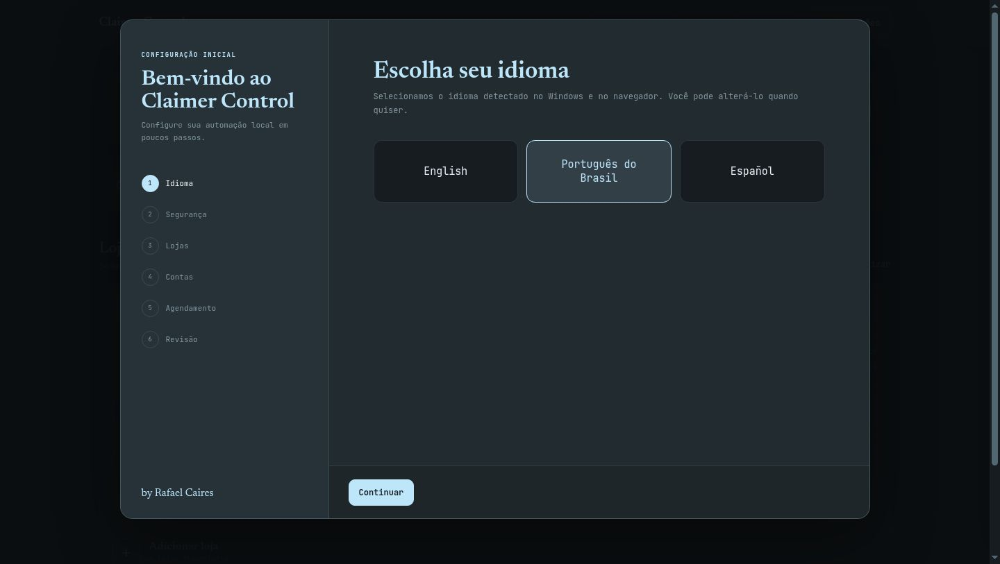
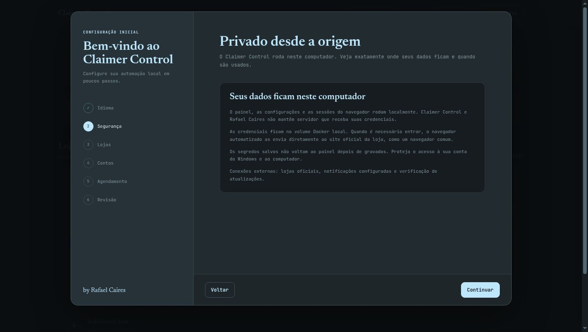
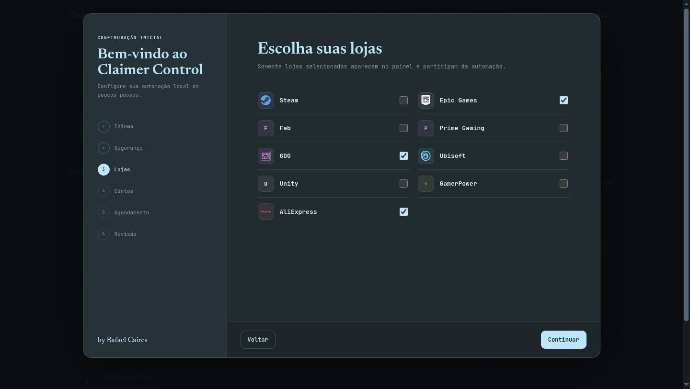
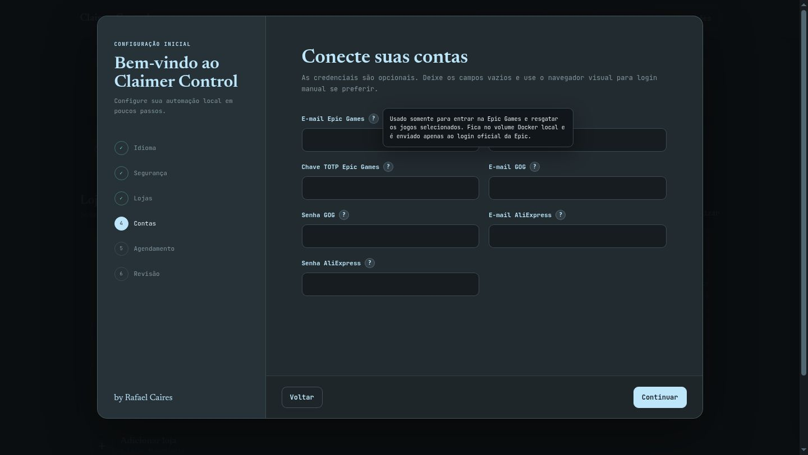
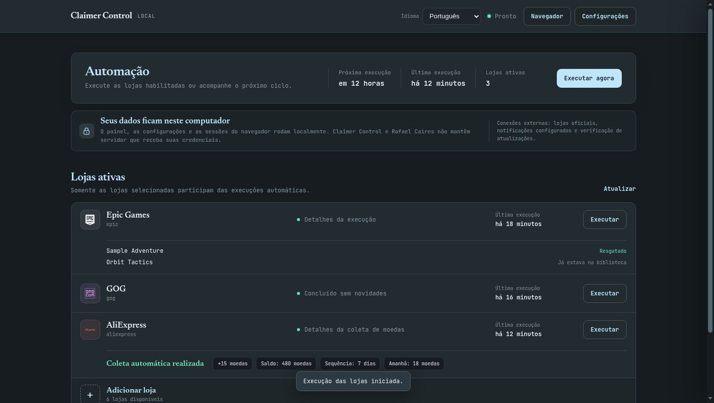
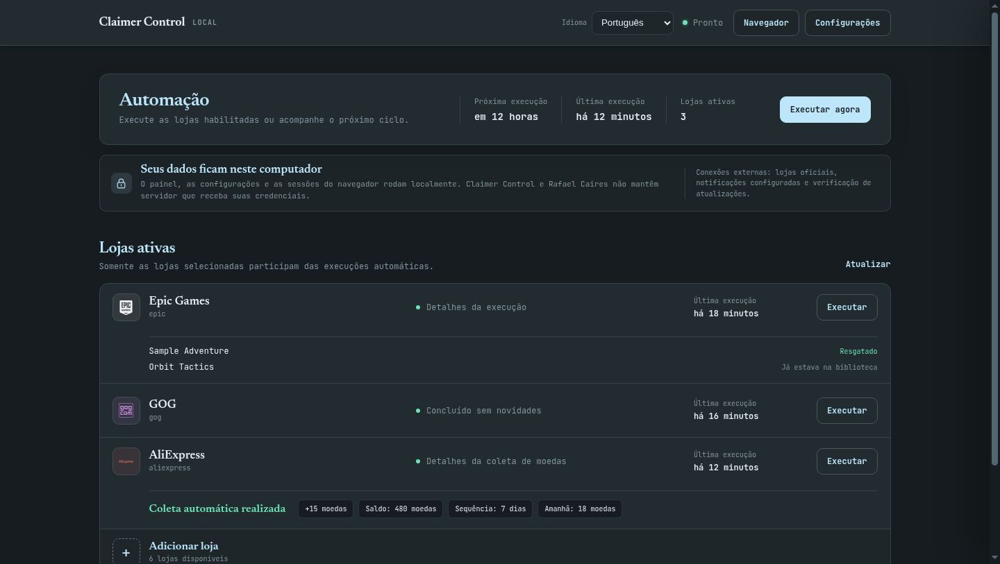
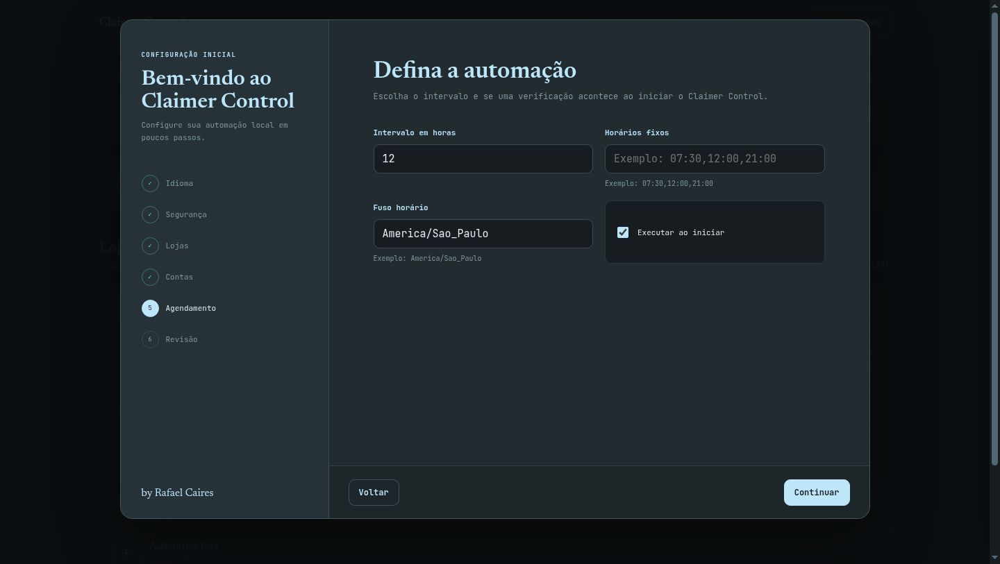
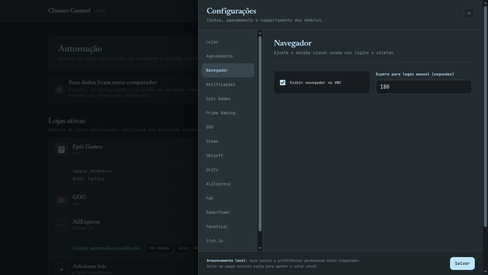

# Claimer Control

<p align="center">
  <strong>A local control panel that collects free games and AliExpress daily coins for you.</strong><br>
  <sub>The dashboard, account settings and browser sessions stay on your computer.</sub>
</p>

<p align="center">
  <a href="./README.md">English</a> ·
  <a href="./docs/README.pt-BR.md">Português do Brasil</a> ·
  <a href="./docs/README.es.md">Español</a>
</p>

<p align="center">
  <a href="https://github.com/rafaelcairess/free-games-claimer-remaster-gui/releases/latest/download/Claimer-Control-Setup.exe"><strong>Download for Windows</strong></a>
  · <a href="https://github.com/rafaelcairess/free-games-claimer-remaster-gui/releases/latest">Release notes &amp; SHA-256</a>
</p>

> [!IMPORTANT]
> Claimer Control does not operate a credential server and includes no telemetry. Credentials entered in the local dashboard are stored in your local Docker volume and are sent only by the automated browser to each store's official login. See [Security](#security-and-credentials).

Claimer Control is maintained by [Rafael Caires](https://github.com/rafaelcairess) and built on [P-Adamiec/Free-Games-Claimer-Remaster](https://github.com/P-Adamiec/Free-Games-Claimer-Remaster), an independent Python rewrite inspired by [vogler/free-games-claimer](https://github.com/vogler/free-games-claimer). Original attribution and the AGPL-3.0 license are preserved.

Automatically claims free games on:

-  **Steam** – via [SteamDB](https://steamdb.info/upcoming/free/) scraping (only *Free to Keep*, not *Play for Free*)
-  **Epic Games Store** – weekly free games, including the weekly free Android/iOS mobile game (`EG_MOBILE`)
-  **Fab** – Epic's asset marketplace
-  **Unity Asset Store** – the weekly free [Publisher of the Week](https://assetstore.unity.com/publisher-sale) asset, coupon and all (opt-in, add `unity` to `STORES`)
-  **Amazon Prime Gaming** – monthly Prime Gaming catalogue + GOG key redemption
-  **GOG** – periodic free giveaways
-  **Ubisoft** – free game giveaways from [ubisoft.com/games/free](https://www.ubisoft.com/en-us/games/free) (giveaways only, never trials, demos or free weekends)
-  **AliExpress** – automated daily check-in that collects coins, using a real-device mobile fingerprint to stay undetected and reading the balance from the coin API. The coin page sometimes arrives empty; the bot gives it one more approach, then reports it and moves on instead of retrying for half an hour (see [Troubleshooting](#troubleshooting))

**GamerPower API**, on by default, finds giveaways the stores themselves do not advertise, then hands each one to the matching store above. It routes to these extra sites too, each behind its own switch (still under development):
-  **Fanatical** – auto-bypasses cookie banners and hooks Steam accounts to grab weekly PC drops.
-  **Itch.io** – DRM-free indie giveaways, claimed to your library and verified there (needs `ITCHIO_ENABLE=true`; with two-factor sign-in the bot asks you for the code over VNC)
-  **IndieGala** – free Steam keys & DRM-free games
-  **Alienware Arena** – (Notify-only) ARP point giveaways

> [!TIP]
> **There is more free stuff out there than the storefronts show you.** Epic advertises two games a week
> on its front page, but GamerPower regularly lists half a dozen more that are free right now on the very
> same account, and other stores are no different. That is why `gamerpower` runs by default: it only ever
> claims on stores you already run, so if `STORES=steam,gamerpower` it will take the Steam giveaways and
> leave the Epic ones alone. The extra sites (Fanatical, Itch.io, IndieGala, Alienware Arena) stay off
> until you set their own `*_ENABLE` switch.

Runs as a Docker container with a built-in scheduler (every 12 hours by default, with optional fixed daily run times). Login via **VNC in browser** or automated credentials.

---

## Quick start

### Windows — recommended

1. Download **[Claimer-Control-Setup.exe](https://github.com/rafaelcairess/free-games-claimer-remaster-gui/releases/latest/download/Claimer-Control-Setup.exe)** from the latest Release.
2. Run the installer. If Docker Desktop is missing, Claimer Control explains why it is needed and installs it from Docker's official source after your confirmation.
3. The local dashboard opens automatically. Follow the six-step setup wizard, choose your stores and optionally enter account credentials.

The installer may request administrator permission and a Windows restart while Docker is installed. It resumes after sign-in, creates desktop and Start menu shortcuts, and can start Claimer Control with Windows. The application installer is currently unsigned, so Windows SmartScreen may show an unknown-publisher warning. Verify `SHA256SUMS.txt` from the same Release before continuing.

### Linux, NAS or source installation

#### Prerequisites

- [Docker](https://docs.docker.com/get-docker/) and Docker Compose

> 🟢 **New to Docker on Windows?** Read the step-by-step [**WINDOWS_BEGINNER_GUIDE.md**](./WINDOWS_BEGINNER_GUIDE.md) to set up Docker Desktop, optimize RAM limits, and use Dockhand to deploy this flawlessly.

#### 1. Clone and configure

```bash
git clone https://github.com/rafaelcairess/free-games-claimer-remaster-gui.git
cd free-games-claimer-remaster-gui
cp .env.example .env  # or edit the existing .env
```

Edit `.env` with your credentials:

```ini
# Epic Games
EG_EMAIL=your@email.com
EG_PASSWORD=your_password

# Prime Gaming (Amazon)
PG_EMAIL=your@email.com
PG_PASSWORD=your_password

# GOG
GOG_EMAIL=your@email.com
GOG_PASSWORD=your_password

# Steam
STEAM_USERNAME=your_username
STEAM_PASSWORD=your_password

# Ubisoft
UBI_EMAIL=your@email.com
UBI_PASSWORD=your_password

# AliExpress
AE_EMAIL=your@email.com
AE_PASSWORD=your_password

# Notifications
DISCORD_WEBHOOK=https://discord.com/api/webhooks/...

# Run only specific stores (comma-separated)
# Leave commented to run the defaults (everything except unity)
# STORES=steam,prime,gog
```

#### 2. Run container

```bash
docker compose up -d
```

When running directly from a source checkout after changing or updating the
code, rebuild the local image first with `docker compose up -d --build app`.

On Windows source checkouts, you can double-click `Start-Claimer-Control.cmd`.

> 💡 **Need a reproducible version?** Set `CLAIMER_TAG` to a published tag such as `v1.0.0` before starting Docker.

#### 3. Login (first run)

Open **http://localhost:7080** in your browser to access the VNC session.

Each store will wait for you to login manually on the first run if you don't supply credentials. After that, session cookies are natively restored using persistent browser profiles!

#### Local dashboard

Open **http://localhost:8080** to see each store's status, start all stores or
just one store, open the browser session, and edit the supported settings.

Settings saved in the dashboard are stored in `data/gui.env` inside the
persistent Docker volume. Existing secrets are never sent back to the browser;
leave a secret field blank to keep its current value. The Compose configuration
binds this port to `127.0.0.1` by default, so the dashboard is available only on
the computer running Docker. Do not expose port 8080 directly to the internet.

On the packaged Windows install, the first opening shows a guided setup for language, privacy, stores, optional credentials and scheduling. Select **English**, **Português do Brasil** or **Español**, or keep the language detected from Windows and your browser. Every credential field has an accessible `?` explanation and supports manual login as an alternative.

#### 4. Monitor

To see what the bot is doing in real-time regardless of your current terminal folder, inspect the container directly:
```bash
docker logs -f fgc-remaster
```

## Security and credentials

| Question | Answer |
|---|---|
| Does Claimer Control receive my passwords? | No. There is no Claimer Control or Rafael Caires server receiving dashboard data. |
| Where are credentials saved? | In `gui.env` inside the local Docker volume, with restricted file permissions. |
| Do credentials ever leave the computer? | Only when the automated browser sends them directly to the official store login, exactly as a normal browser must. |
| Can the dashboard read saved passwords back? | No. Its API returns only whether each secret is configured. |
| Is the dashboard public? | No. Docker binds it to `127.0.0.1` by default. Do not expose port 8080 to the internet. |
| Is there telemetry? | No. External traffic is limited to stores, notifications you configure and update checks. |

Account credentials are optional. You may leave them blank, open the visual browser, and sign in manually. Browser profiles persist locally, so most stores can reuse that session later. Protect your Windows account and disk: locally stored browser sessions and secrets are sensitive data.

## Product tour

All screenshots use synthetic accounts and sample results. No real account, token, cookie or local path is shown.

| First-time setup | Local security |
|---|---|
|  |  |

| Choose stores | Understand credential fields |
|---|---|
|  |  |

| Run dashboard | AliExpress coins |
|---|---|
|  |  |

| Scheduling | Manual browser login |
|---|---|
|  |  |

### 5. Unity, first run only

Unity is opt-in (`STORES=...,unity`) and its checkout refuses the free coupon until your Unity account
carries a complete billing address. That is the one thing the bot cannot invent for you, so on the first
claim it opens the checkout, pings you the same way it does for a login, and waits **5 minutes**:

1. Open the VNC session and fill in what it names as missing: first name, last name, address, postal code and city.
2. Answer **"Are you exempt from paying consumption tax?"** with **No**, unless you genuinely have a tax number. With one on the account, the bot leaves that section alone.
3. Leave the page as it is, the bot applies the coupon and finishes the claim in the same session.

Unity keeps this on your account, so every later week runs unattended. Missing the window is not a
failure: the asset is reported as `skipped:setup`, the rest of the run carries on, and the next run tries
again (each giveaway lasts a week).

> [!NOTE]
> **The claim is written for Unity's checkout in English**, which is what the bot's browser profile asks
> for. It finds the coupon box, the total and the confirm button by their English labels. If your account
> forces another language onto the checkout, the bot cannot read the amount, so it refuses to confirm the
> order and reports the asset as not claimed. It never pays in that state: the only thing it ever confirms
> is a total of exactly zero. Set the Asset Store language back to English and the claim works again.

---

## Configuration

Options are set via environment variables in `.env`:

| Variable | Default | Description |
|---|---|---|
| `CLAIMER_TAG` | `latest` | Claimer Control image tag. The Windows updater pins this to the selected Release. |
| `SHOW` | `1` | Show browser window (VNC). |
| `WIDTH` | `1280` | Browser/VNC screen width. |
| `HEIGHT` | `720` | Browser/VNC screen height. |
| `NOVNC_PORT` | `7080` | noVNC web access port. |
| `GUI_ENABLED` | `true` | Enable the local control dashboard. |
| `GUI_PORT` | `8080` | Host port for the local dashboard, bound to `127.0.0.1` by Docker Compose. |
| `GUI_SETUP_REQUIRED` | `false` | Pause automatic runs until the local onboarding wizard is complete. Enabled by the Windows installer. |
| `VNC_IP` | `localhost`| Host for VNC notification links. Alerts include a one-click `http://<VNC_IP>:<NOVNC_PORT>/?autoconnect=true`. |
| `VNC_URL` | | Full public noVNC address for notification links, e.g. `https://fgc.example.tld`. Use it behind a reverse proxy: it keeps your scheme and drops the port, replacing `VNC_IP` and `NOVNC_PORT` in the link (`NOVNC_PORT` still publishes the container port). |
| `VNC_PASSWORD` | | Optional password for VNC access (empty = no password). |
| `SCHEDULER_HOURS`| `12` | Interval in hours between automatic claiming runs. Accepts any positive number (for example: `1`, `12`, `24`, `72`). Set `0` to disable interval runs. |
| `SCHEDULER_TIMEZONE` | `UTC` | IANA timezone used for fixed daily scheduler times. |
| `SCHEDULER_FIXED_TIMES` | | Optional comma-separated daily run times in 24-hour `HH:MM` format (`17:00,21:30`). Set `SCHEDULER_HOURS=0` if you want *only* these fixed daily times without interval runs. |
| `RUN_ON_STARTUP` | `true` | Run once immediately when the container/application starts. |
| `VNC_LOGIN_TIMEOUT`| `180` | Seconds to wait for you to log in via VNC manually. |
| `TIMEOUT` | `60` | Advanced: seconds to wait for a page element before giving up. |
| `EMAIL` | | Default login email used by ALL stores unless a store-specific `*_EMAIL` overrides it. |
| `PASSWORD` | | Default login password used by ALL stores unless a store-specific `*_PASSWORD` overrides it. |
| `EG_EMAIL` | | Epic Games login email. |
| `EG_PASSWORD` | | Epic Games login password. |
| `EG_OTPKEY` | | Epic Games authenticator (TOTP) key, auto-filled. Email/SMS codes are entered manually via VNC. |
| `EG_PARENTALPIN` | | Epic Games Parental Controls PIN. |
| `EG_MOBILE` | `true` | Also claim Epic's weekly free mobile game (claimed on the same store page as the PC games). |
| `EG_MOBILE_PLATFORMS` | `android,ios` | Which mobile versions to claim, Android and iOS are separate items of the same game. |
| `PG_EMAIL` | | Prime Gaming (Amazon) email. |
| `PG_PASSWORD` | | Prime Gaming password. |
| `PG_OTPKEY` | | Prime Gaming 2FA OTP key. |
| `PG_FORCE_CHECK_COLLECTED` | `0` | Force re-check already marked 'claimed' games. |
| `PG_REDEEM` | `0` | Try to redeem keys automatically on external stores. |
| `PG_CLAIMDLC` | `0` | Try claiming DLCs as well (experimental). |
| `GOG_EMAIL` | | GOG login email. |
| `GOG_PASSWORD` | | GOG login password. |
| `GOG_NEWSLETTER` | `0` | Keep newsletter sub after claiming (1 = keep). |
| `GOG_FORCE_REDEEM` | `0` | Force re-redeem old GOG codes from Prime Gaming. |
| `GOG_OTP_ENABLE` | `false`| Use backup codes for GOG 2FA. |
| `GOG_OTP_CODES` | | Comma-separated list of GOG backup codes. |
| `STEAM_USERNAME` | | Steam username. |
| `STEAM_PASSWORD` | | Steam password. |
| `FAB_ACCEPT_EULA` | `true` | Let the bot accept Fab's licence agreement and the EU right-of-withdrawal waiver, both required to claim. Set to `false` to stop before them. Fab reuses `EG_EMAIL` / `EG_PASSWORD` / `EG_OTPKEY`. |
| `UNITY_EMAIL` | | Unity Asset Store login email. |
| `UNITY_PASSWORD` | | Unity Asset Store password. |
| `UNITY_ACCEPT_TOS` | `true` | Accept the Asset Store EULA and the 14-day withdrawal waiver at Unity's checkout. Set to `false` to stop before them and be notified instead. |
| `UBI_EMAIL` | | Ubisoft Connect login email. |
| `UBI_PASSWORD` | | Ubisoft Connect password. |
| `UBI_OTPKEY` | | Ubisoft authenticator (TOTP) secret, for accounts with two-step verification. |
| `AE_EMAIL` | | AliExpress login email. |
| `AE_PASSWORD` | | AliExpress login password. |
| `AE_MIN_COINS` | `2` | Skip the daily check-in when it offers fewer coins than this (protects against the 1-coin bot-flag state). |
| `AE_FLAG_RETRIES` | `3` | How many times to wait and re-approach the coin page when the offer is capped. |
| `AE_FLAG_WAIT` | `480` | Seconds to wait between retries (kept above AliExpress' ~7-min penalty so one wait clears it). |
| `AE_PAGE_RETRIES` | `4` | How many extra approaches to make when the coin page loads but renders nothing. AliExpress serves it empty most of the time (measured: one usable page in eight looks), so each retry is a real chance at the daily check-in. `0` gives up on the first look. |
| `STORES` | *(see note)* | Comma-separated list of stores to run. Empty runs `steam`, `epic`, `fab`, `prime`, `gog`, `ubisoft`, `aliexpress`, `gamerpower`; add `unity` here to enable it too. GamerPower only delegates to the stores in this list, so `steam,gamerpower` skips its Epic giveaways. |
| `RESET_DB_GAMES` | `false` | Retroactively erase any database claims recorded within the last 7 days upon execution. Assists in clearing false positives. |
| `GP_CLAIM_DLC` | `false` | Also process GamerPower's in-game DLC giveaways. Off by default: most need an account in that specific game, and they are the bulk of the feed. |
| `FANATICAL_ENABLE`| `false`| Enable Fanatical claiming via GamerPower. |
| `FANATICAL_EMAIL` | | Fanatical account email. |
| `FANATICAL_PASSWORD`| | Fanatical account password. |
| `ALIENWARE_ENABLE`| `false`| Enable Alienware Arena notifications via GamerPower. |
| `ITCHIO_ENABLE`| `false`| Enable Itch.io claiming via GamerPower. |
| `ITCHIO_EMAIL` | | Itch.io account email. |
| `ITCHIO_PASSWORD` | | Itch.io account password. |
| `ITCHIO_OTP_ENABLE` | `false` | Allow the bot to spend an Itch.io recovery code. Authenticator codes are never stored: for those the bot asks you over VNC. |
| `ITCHIO_OTP_CODES` | | Comma-separated Itch.io recovery codes, used one per login and recorded in `data/used_itchio_codes.txt` so none is sent twice. |
| `INDIEGALA_ENABLE`| `false`| Enable IndieGala claiming via GamerPower. |
| `INDIEGALA_EMAIL` | | IndieGala account email. |
| `INDIEGALA_PASSWORD`| | IndieGala account password. |
| `UNKNOWN_STORES_ENABLE`| `false`| Open unsupported external stores for manual claiming via VNC. |
| `BROWSER_DIR` | `data/browser` | Browser profile directory (persists cookies/sessions). |
| `SCREENSHOTS_DIR` | `data/screenshots` | Directory where debug/failure screenshots are saved. |
| `DEBUG` | `true` | Shows verbose actions the bot takes. |
| `DEBUG_LIBS` | `false` | Adds the internals of the libraries the bot uses (every CDP frame sent to Chrome, HTTP handshakes, SQL queries). Only turn this on if a bug report asks for it. |
| `DRYRUN`| `false` | Simulate a run without claiming games. Detects available giveaways and sends a summary report. |
| `DISCORD_WEBHOOK` | | Discord webhook URL for notifications. |
| `NOTIFY` | | Apprise URL(s) for Telegram, Slack, ntfy, etc. Multiple services can be separated by commas. |
| `NOTIFY_TEST` | `false` | Send a test notification on startup to verify your setup works. |
| `NOTIFY_SUMMARY` | `true` | Set to false to disable game claim summaries. (Applies to all services) |
| `NOTIFY_ERRORS` | `true` | Set to false to disable fatal error alerts. (Applies to all services) |
| `NOTIFY_CLAIM_FAILS`| `false` | Set to true to also report games that could not be claimed (e.g. a free DLC without the base game) in alerts and the run summary. (Applies to all services) |
| `NOTIFY_ALREADY_CLAIMED`| `false` | Set to true to also list games you already own and check-ins already collected today. By default the summary shows only what actually changed in that run. |
| `NOTIFY_UPDATES` | `true` | Check GitHub for a newer release (at startup, then at most once a day) and notify you once per version. Set to false to disable the check entirely, no request is made. |
| `NOTIFY_LOGIN_REQUEST`| `true` | Set to false to disable VNC login request pings. (Applies to all services) |
| `NOTIFY_SKIP_STORES` | | Comma-separated store keys whose notifications are silenced (they still run/claim). Accepts aliases (`ae`, `amazon`, `gp`). Example: `aliexpress`. |

### Scheduler

The application supports three scheduling modes: running on a recurring interval (`SCHEDULER_HOURS`), running at specific daily clock times (`SCHEDULER_FIXED_TIMES`), or combining both.

### Scheduling Modes & Interaction

1. **Interval-Only Mode (Default)**: Runs periodically every `n` hours.
   ```ini
   SCHEDULER_HOURS=12
   SCHEDULER_FIXED_TIMES=
   ```
   - `SCHEDULER_HOURS` accepts any positive number (e.g. `1`, `12`, `24`, `48`, `72`).
   - The timer counts exactly `SCHEDULER_HOURS` from when the container/application started.

2. **Fixed Daily Times Mode**: Runs *only* at specific wall-clock times every day (ideal for timing drop windows like 17:00 Epic Games releases). To use only fixed daily times without interval runs, set `SCHEDULER_HOURS=0`.
   ```ini
   SCHEDULER_HOURS=0
   SCHEDULER_TIMEZONE=Europe/Berlin
   SCHEDULER_FIXED_TIMES=17:00,21:30
   ```
   - `SCHEDULER_FIXED_TIMES` accepts comma-separated 24-hour `HH:MM` strings.
   - `SCHEDULER_TIMEZONE` specifies the IANA timezone used for matching these times (`UTC`, `Europe/Berlin`, `America/New_York`), automatically accounting for Daylight Saving Time transitions.

3. **Combined Mode**: Runs *both* every `SCHEDULER_HOURS` **and** at each `SCHEDULER_FIXED_TIMES` independently.
   ```ini
   SCHEDULER_HOURS=24
   SCHEDULER_TIMEZONE=Europe/Berlin
   SCHEDULER_FIXED_TIMES=17:00
   ```

> [!NOTE]
> By default, `RUN_ON_STARTUP=true` is enabled, so the bot always performs **one initial check immediately on startup**, regardless of whether you configure `SCHEDULER_HOURS` or `SCHEDULER_FIXED_TIMES`. Set `RUN_ON_STARTUP=false` if you want it to wait until the first scheduled trigger.

### Selective module execution

Run only specific stores using accepted module aliases (`steam`, `epic`, `prime`, `gog`, `amazon`, `ubisoft`/`ubi`, `fab`, `unity`, `aliexpress`/`ae`, `gamerpower`/`gp`):

```bash
# Method 1: Via environment variable (recommended)
# Edit .env: STORES=steam,amazon

# Method 2: Temporary execution via Docker Compose
STORES=epic,gog docker compose up -d

# Method 3: One-off immediate run inside Docker (ignores scheduler)
docker compose run --rm app python main.py steam gog --once
```

To skip a store, list the ones you want and leave that one out. There is no `STEAM_ENABLE` style switch
for the stores above, and a setting the bot does not read is now named at startup instead of being
ignored in silence. For example `STORES=epic,fab,prime,gog,ubisoft,aliexpress,gamerpower` runs everything
except Steam, and GamerPower then leaves its Steam giveaways alone too, naming each one it skips in the
log. Giveaways that hand out a Steam key (Fanatical, IndieGala) are a different thing: when you enable
those sites the key lands in your notification and in the database, and the bot never signs in to Steam
to redeem it.

---

## Architecture

```
claimer-control/
├── main.py                 # Entry point + scheduler + CLI + run summary
├── docker-compose.yml      # Container configuration
├── installer/              # Localized Windows launcher + Inno Setup package
├── Dockerfile              # Debian bookworm-slim + Chrome/Chromium + TurboVNC + noVNC
├── docker-entrypoint.sh    # Starts the virtual display, VNC and the bot
├── requirements.txt        # Python dependencies
├── CHANGELOG.md            # What changed in every release
├── MODIFICATIONS.md        # Codebase overhaul technical reference
├── WINDOWS_BEGINNER_GUIDE.md
├── .env                    # Your local configuration (gitignored)
├── .env.example            # Configuration template
├── data/                   # Everything the bot keeps (Docker volume)
│   ├── fgc.db              # SQLite database of what was already claimed
│   ├── browser/<store>/    # One persistent Chrome profile per store
│   └── screenshots/<store>/# Screenshots taken on failures
├── src/
│   ├── version.py          # Version string
│   ├── gui/                # Local dashboard, settings API and three locales
│   ├── core/               # Shared engine components
│   │   ├── claimer.py      # BaseClaimer: browser launch, login waits, notifications
│   │   ├── config.py       # Typed configuration loader (.env → Python)
│   │   ├── database.py     # SQLAlchemy models & SQLite engine
│   │   ├── notifier.py     # Modular Discord/Apprise webhooks
│   │   ├── selection.py    # Which stores this run covers (GamerPower reads it)
│   │   ├── updates.py      # Tells you when a newer release is published
│   │   └── url_security.py # Hostname checks for redirects (never substring matching)
│   └── stores/             # Store-specific claiming modules
│       ├── epic.py         # Epic Games Store
│       ├── prime.py        # Amazon Prime Gaming
│       ├── gog.py          # GOG (+ GOG code redemption from Prime)
│       ├── steam.py        # Steam (SteamDB scraping)
│       ├── epic_fab.py     # Fab limited-time free assets (shares Epic's session)
│       ├── unity.py        # Unity Asset Store weekly free asset
│       ├── ubisoft.py      # Ubisoft giveaways (ubisoft.com/games/free)
│       ├── aliexpress.py   # AliExpress check-in & coin collecting
│       ├── epic_mobile.py  # Epic's weekly free Android/iOS game (detection only)
│       └── gamerpower.py   # GamerPower API (Fanatical, Itch.io, IndieGala, Alienware)
└── tests/                  # Fast unit tests for pure logic (no browser, no accounts)
```

### How it works

1. **Scheduler** (`main.py`) supports recurring interval timers (`SCHEDULER_HOURS`), fixed daily drop windows (`SCHEDULER_FIXED_TIMES`), combined execution, and initial startup checks (`RUN_ON_STARTUP`).
2. Each store module **starts its own browser** with an isolated profile, securely recalling session cookies (`--restore-last-session`). Two exceptions save a login: Fab rides Epic's profile, and GamerPower claims a whole store's giveaways in one session instead of one browser per game.
3. **Login detection** checks the page DOM (not just cookies/DB).
4. **Fingerprint** is the one nodriver's patched Chrome produces by itself, because a hand-written desktop spoof did not match the real container and started summoning captchas (see CHANGELOG 1.4). Only AliExpress overrides it, injecting one coherent real-device Android fingerprint (`browserforge`) over the Chrome DevTools Protocol.
5. **Game discovery** prefers each store's own data over scraping the page: Epic's promotions API, Ubisoft's embedded news feed, Fab's free-content blade, the GamerPower API, and SteamDB for Steam.
6. **Store selection** (`STORES`) is published to the run, so GamerPower only claims on stores you actually enabled instead of forcing every giveaway it finds.
7. **Robust Database Storage** verifies historical success in `fgc.db` (SQLite) to block aggressive overlapping.
8. **Clean Notifications** dispatch to you dynamically based on the toggles configured in the `.env` settings, and a daily update check tells you when a newer release is out (`NOTIFY_UPDATES`).

---

## Notifications

Both Discord and Apprise can be configured simultaneously, notifications are sent to ALL configured services in parallel via async dispatch.

- **Discord**: Set `DISCORD_WEBHOOK` in `.env`.
- **Apprise (Telegram, Slack, Email, ntfy, etc.)**: Set `NOTIFY` in `.env`. You can provide multiple URLs separated by commas (e.g. `NOTIFY=ntfy://topic, tgram://token/id`).
- **Fine-Tune Filtering**: Use `NOTIFY_SUMMARY=false`, `NOTIFY_ERRORS=false`, etc., to silence specific notification subsets across all services globally.
- **Testing**: Set `NOTIFY_TEST=true` to receive a test notification whenever the container starts.

---

## Troubleshooting

| Issue | Solution |
|---|---|
| Store not logging in | Open VNC (`http://localhost:7080`) and login manually. Your credentials or session logic persist beautifully after first login. |
| Steam game not detected | Check that the game is listed on [SteamDB Free](https://steamdb.info/upcoming/free/). |
| GamerPower missing games | Certain platforms (Itch.io, IndieGala, Alienware, Fanatical) require explicit `{STORE}_ENABLE=true` toggles in configuration to activate their respective handlers. Giveaways for Steam, Epic or GOG are skipped when that store is not in your `STORES` list. |
| Unity coupon not applied | Unity blocks the coupon while its checkout form is incomplete, see [5. Unity, first run only](#5-unity-first-run-only). Two other reasons it stops on purpose: a checkout rendered in a language other than English, and `UNITY_ACCEPT_TOS=false`, which halts right before the EULA. |
| AliExpress coins not collected | The coin page sometimes loads as an empty shell. The bot tries once more (`AE_PAGE_RETRIES`), then reports it and moves on rather than retrying for half an hour. It has been seen working again on a later run; collect in the mobile app if it persists. |
| Epic captcha | The stealth patches prevent 99% of captchas. EU 'Right of withdrawal' overlays are automatically accepted. If a rigorous manual prompt arrives, solve it once via VNC. |
| False positive claims | Set `RESET_DB_GAMES=true` in your `.env`, reboot the container, and the bot will forget the last 7 days of claims, allowing the logic to try claiming them again. |
| Setting seems to be ignored | The bot names every setting it does not read at startup, for example an invented `STEAM_ENABLE`, and every value that cannot mean what it says, for example `DRYRUN=maybe`, which counts as false. Passwords, e-mail addresses and webhook URLs are masked in that message. |
| Container crashes on start | Check logs: `docker compose logs app --tail=50`. A clean restart purges `.X1-lock` bugs. |

### Something is not working, what to send us

The normal log shows only what you act on: which store is running, who is signed in, what was found and
what was claimed, plus every warning and error. All the diagnostic detail is still there, one switch away:

1. Set `DEBUG=true` in `.env` and restart (`docker compose up -d`), then reproduce the problem.
2. Collect the log: `docker logs fgc-remaster --tail 500 > fgc.log`. Account names are masked for you (`p***@gmail.com`), so it is safe to paste.
3. Look in the `data/` folder for what the bot saw:
   - `data/screenshots/<store>/`, screenshots taken at every failure,
   - `data/ae_coin_api.json`, raw AliExpress check-in responses (streak, coins),
   - `data/steamdb_dump.html`, the SteamDB page as the bot parsed it (written only with `DEBUG=true`),
   - `data/*_fail.html`, page snapshots from failed logins/check-ins.
4. Watch it live if it is still running: open `http://localhost:7080` (noVNC) and take over the browser.

A good bug report is: what you expected, what happened, the `DEBUG=true` log around the failure, and the
matching screenshot. `DEBUG=true` covers what the bot itself did; only add `DEBUG_LIBS=true` if you are
asked for the raw network or browser traffic, because that turns one run into tens of thousands of lines.
Please switch both off again once the problem is solved.

---

## Credits

**Claimer Control interface and Windows distribution:** [Rafael Caires](https://github.com/rafaelcairess).

Built on [P-Adamiec/Free-Games-Claimer-Remaster](https://github.com/P-Adamiec/Free-Games-Claimer-Remaster), the independent Python rewrite maintained by Paweł Adamiec and its contributors. That project was inspired by [vogler/free-games-claimer](https://github.com/vogler/free-games-claimer). See the Git history and [THIRD_PARTY_NOTICES.md](./THIRD_PARTY_NOTICES.md) for complete attribution.

---

## License

[AGPL-3.0](./LICENSE)

---

## Analytics

[](https://www.star-history.com/?repos=rafaelcairess%2Ffree-games-claimer-remaster-gui&type=date&legend=bottom-right)
